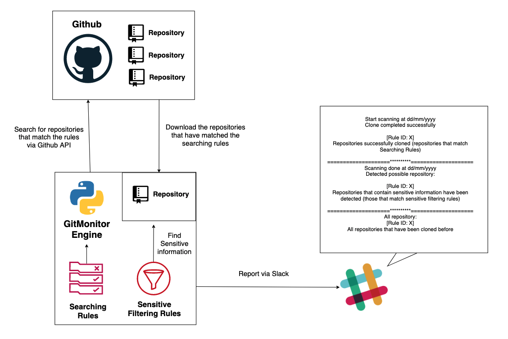

# GitMonitor is a Github scanning system to look for leaked sensitive information based on rules

[](https://www.gnu.org/licenses/gpl-3.0)
<p align="center">
        
</p>

<center>
  <h1 style="text-align:center;">GitMonitor</h1>
</center>

## Summary

GitMonitor is a Github scanning system to look for leaked sensitive information based on rules. I know that there are a lot of very good other tools for finding sensitive information leaked on Github right now, I myself currently still use some of them. However, I think they still lack some features like:

+ A scanning tool based on the rules.
+ The rules mechanism allows me to write rules in the most flexible way possible. The rules allow me to filter information by brand name, file format and by language. As well as allowing me to skip specific file formats and languages (Searching rules). Then clone the repositories that have matched the rules to local before start looking for the sensitive information that exists there based on regular expressions (Sensitive filtering rules). You can do that by defining keywords related to your company brand name, keywords related to your company's projects, email prefixes, or anything else in the rules.
+ The tool can launch on schedule and has a flexible reporting mechanism.

That is why I created this tool - GitMonitor.

## Features

+ Search the repository based on rules (Searching rules). You can write rules to search for repositories that may be related to your company. The repositories matching the rules will be cloned to local.
+ Use Regex (Sensitive filtering rules) to search for sensitive information that exists in cloned repository, for classification purposes.
+ Report via Slack.
+ Rules and regex are defined separately
+ Users can define rules and regex easily and intuitively.



## Requirements

+ Python3, Python3-pip

Tested on Ubuntu 18.04.

## Setup

+ Install requirements:

```bash
Python3 -m pip install -r requirements.txt
```

Please make sure you have Pyyaml version 5x or higher installed

+ Fill in the required information in the configuration file (config.ini):

```ini
[git]
 user = <username_git>
 pass = <password_git>
 url_code = https://api.github.com/search/code?q={}+in:file&sort=indexed&order=desc
 url_repos = https://api.github.com/search/repositories?q={}+size:>0+is:public&sort=indexed&order=desc
 url_commit = https://api.github.com/search/commits?q={}+is:public&sort=indexed&order=desc
 rpp = 50
 
 [slack]
 webhooks = <full_link_webhooks>
 
 
 [path]
 rule = <path to rule folder>
 source = <path to folder to clone repository>
 log = <filename of log>
 
 [msg]
 start = ====================**********====================
 
         *Start scanning at {}*
         _Clone completed successfully:_
 end = ====================**********====================
 
       *Scanning Done at {}*
       _Detected possible repository:_
 all = ====================**********====================

```

+ Write the rules (Searching rules). Put your rules in the rules directory:

```yaml
 id: Project_X_Matching
 key: X
 language:
   - java
 #filename:
 #  - LICENSE
 #extension:
 #  - py
 #  - md
 ignore:
 #  language:
 #    - php
   filename:
     - LICENSE
   extension:
     - html
     - txt

```
+ Define the regular expressions in libs/regex.py file (Sensitive filtering rules).

+ Run:

```bash
Python3 gitmonitor.py
```
+ You can schedule automatic running for the tool by using Cronjob.


## My Team

+ [Tony](https://github.com/crazykid95) - Project Lead
+ [musashi137](https://github.com/musashi137) - Core Dev

## Special Thanks

+ [GitMAD](https://github.com/deepdivesec/GitMAD) for regex-based sensitive information search mechanism

## Contributing

Many areas of this project could be improved and change significantly while refactoring current code and implementing new features. Feedback with improvements and pull requests from the community will be highly appreciated and accepted.

In general, we follow the "fork-and-pull" Git workflow.

1. Fork the repo on GitHub
2. Clone the project to your own machine
3. Commit changes to your own branch
4. Push your work back up to your fork
5. Submit a Pull request so that we can review your changes

NOTE: Be sure to merge the latest from "upstream" before making a pull request!
